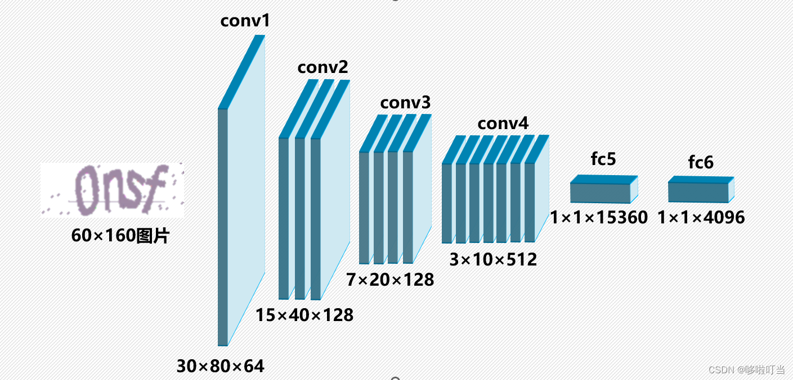
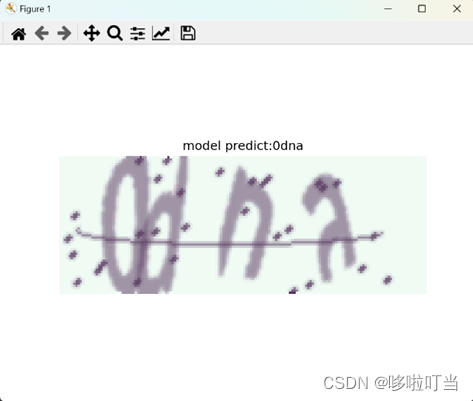

# CNN_captcha_recognition
This project uses a Convolutional Neural Network (CNN) to recognize captchas. The model is implemented using PyTorch and the captcha dataset is generated using the captcha library.  

  

## Project Structure

- `model.py`: Contains the definition of the CNN model.
- `datasets.py`: Contains functions for generating and preprocessing the captcha dataset.
- `eval.py`: Contains functions for testing the model on a single image or on a test dataset.
- `run.py`: The main script for training the model.  
- `data`: Include train data and test data
- `checkpoint`: Save the checkpoint in your worknames directory

You can install all the dependencies using the following command:

```bash
pip install -r requirements.txt
```

## Dataset Generation

You can generate the dataset using the following command:

```bash
python datasets.py --data_size {} --test_ratio {}
```

## Training

You can train the model using the following command:

```bash
python run.py --workname {} --epochs {}
```

## Testing

You can test the model on a single image or on the test dataset using the following command:

```bash
python eval.py --modelpath {} --mode test_model
python eval.py --modelpath {} --mode test_picture --picpath {}
```

## Results

The following image shows the performance of the model:



## Relate blog
<https://blog.csdn.net/lijj0304/article/details/132446975>